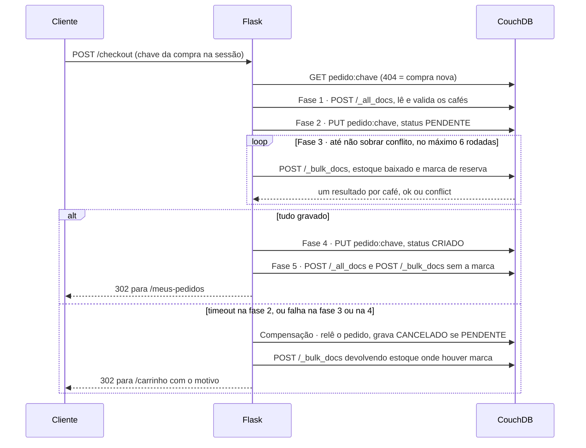

# Checkout como saga

Como a loja fecha um pedido sem transação entre documentos, e por que cada
passo está onde está. Código em `app.py` (seção "Checkout — a saga",
`reconciliar`, rota `checkout`) e `banco.py`; testes em `tests/test_checkout.py`
e `tests/test_rotas.py`. Comparação completa em [`comparacao_relacional_nosql.md`](comparacao_relacional_nosql.md).

## 1. O problema

No projeto relacional (tag `v1-relacional`), o checkout era uma transação.
`finalizar_pedido` no `app.py` da tag, resumido:

```python
try:
    ordenadas = sorted(linhas_carrinho, key=lambda l: l["produto_id"])
    for linha in ordenadas:
        produto = db.session.scalar(
            db.select(Produto)
            .where(Produto.id == linha["produto_id"])
            .with_for_update()
        )
        ...  # café inexistente ou estoque curto: raise, antes de gravar
    ...  # INSERT do pedido CRIADO, com flush() para obter o id
    for produto, linha in travados:
        db.session.add(ItemPedido(...))
        produto.estoque -= linha["quantidade"]
    db.session.commit()
except Exception:
    db.session.rollback()
    raise
```

O `BEGIN` é implícito na primeira consulta; o `FOR UPDATE` trava cada café até
o fim; só o `commit()` torna algo definitivo. O banco dava de graça
**isolamento** (duas compras não liam o mesmo estoque juntas), **atomicidade**
(tudo ou nada) e **recuperação** (conexão que cai antes do `COMMIT` não deixa nada).

No CouchDB, a unidade de consistência é **um documento**: gravar um documento
é atômico. Mas o checkout toca N+1 documentos — o pedido e cada café — e entre
documentos não existe `BEGIN` nem `ROLLBACK` (slide 40: multi-documento "não
atômico"). As três garantias viram código nosso.

## 2. Por que o checkout do projeto-base não basta

O projeto-base segue o slide 36 e fecha assim, com o pedido já `CRIADO`:

```python
result=couch("POST","/_bulk_docs",json={"docs":updates+[pedido]})
if any(x.get('error') for x in result): flash('Conflito no checkout; recarregue e tente novamente.'); return redirect(url_for('carrinho'))
session['carrinho']={}; flash('Pedido criado.'); return redirect(url_for('pedidos'))
```

Cenário: cafés A, B e C com estoque 10; o carrinho leva 2 de cada.

| Momento | A | B | C | Pedidos no banco |
|---|:---:|:---:|:---:|---|
| Outra compra leva 1 de B entre a leitura e o `_bulk_docs` | 10 | 9 | 10 | nenhum |
| Lote: A entra, B volta com `conflict`, C entra, o pedido entra | 8 | 9 | 8 | 1 `CRIADO` |
| O cliente lê "tente novamente", tenta, e desta vez tudo entra | 6 | 7 | 6 | 2 `CRIADO` |

Uma compra virou dois pedidos: A e C perderam 4 unidades cada, B perdeu 2, e o
primeiro pedido diz que vendeu um B que nunca baixou. O `if any(...)` percebe o
erro e não desfaz nada (`docs/plano_nosql.md`, seção 2.2). E o `_bulk_docs` fez o
que promete: cada documento é aceito ou recusado sozinho
(`test_lote_devolve_um_resultado_por_documento`). Slide 26: lote não é transação.

## 3. A solução: uma saga em cinco fases

A saga combina as estratégias do slide 41: **agregado** (itens embutidos no
pedido), **retry** (`atualizar_varios`), **reserva** (a marca no café),
**compensação** (`cancelar_e_devolver`) e **idempotência** (a chave da compra é
o `_id` do pedido). **Eventos** não foram usados (seção 8). Sem conflito, a
saga faz 7 idas ao banco — 8 no clique em Confirmar, porque a rota relê o
carrinho antes —, com um café ou com vários, porque `_all_docs` e
`_bulk_docs` levam o carrinho inteiro de uma vez:



**Fase 1 — ler e validar.** Nada é gravado; as quantidades são somadas por
café, porque grão e fina do mesmo café saem do mesmo estoque. *Por que
primeiro:* falhar aqui não deixa nada para compensar.

**Fase 2 — registrar a intenção.** Grava o pedido `PENDENTE`, com itens e preço
congelado. *Por que antes do estoque:* o `_id` barra a compra repetida antes de
qualquer reserva, e o pedido é o diário pelo qual a reconciliação separa compra
em andamento de abandonada. Se o `PUT` fica sem resposta, a compensação cancela
o pedido, caso ele tenha entrado, e o checkout é interrompido.

**Fase 3 — reservar.** Em cada café, `_reservar` baixa o estoque e grava a marca.
Quem volta com `conflict` é relido e reavaliado: o estoque pode ter acabado.

**Fase 4 — confirmar.** O pedido vira `CRIADO`. *Por que é o ponto sem volta:*
é um documento só, portanto atômico. Antes dele, toda falha é compensada;
depois, a compra vale. É o `COMMIT` da saga.

**Fase 5 — limpar as marcas**, sem mexer no estoque. *Por que por último e em
melhor esforço:* a marca é o que permite compensar com exatidão; depois da
decisão gravada, a que sobrar não altera saldo, e a reconciliação limpa.

## 4. A marca de reserva

```python
def _reservar(produto: dict, pedido_id: str, quantidade: int) -> dict | None:
    reservas = produto.setdefault("reservas", {})
    if pedido_id in reservas:
        return None  # já reservado nesta saga: repetir não baixa de novo
    ...  # café inativo ou estoque curto: raise
    produto["estoque"] -= quantidade
    reservas[pedido_id] = quantidade
    return produto

def _devolver_reserva(produto: dict, pedido_id: str) -> dict | None:
    quantidade = produto.get("reservas", {}).pop(pedido_id, None)
    if quantidade is None:
        return None  # a reserva nunca entrou, ou já foi devolvida
    produto["estoque"] += quantidade
    return produto
```

**Por que ela é necessária.** Se o `_bulk_docs` de reservas fica sem resposta,
o banco pode ter gravado todos os cafés, alguns ou nenhum. Sem marca, toda
saída erra: supor que nada entrou perde estoque; supor que tudo entrou devolve
o que nunca saiu; comparar saldos não serve, porque outras compras mexem no
mesmo estoque. A marca mora **no mesmo documento** da baixa e entra **na mesma
gravação**, que é atômica: marca presente, baixa aplicada. A compensação lê
cada café e devolve onde há marca (`test_timeout_depois_de_gravar_a_reserva_e_desfeito_pelas_marcas`).

**Por que ela torna tudo idempotente.** `_reservar` não baixa de novo onde a
marca existe, `_devolver_reserva` não devolve onde ela já saiu, e
`atualizar_varios` não grava o que a mutação devolve como `None`. Reserva,
compensação e reconciliação podem rodar quantas vezes for preciso.

## 5. A compensação e a ordem

```python
def cancelar_e_devolver(pedido_id: str, motivo: str) -> dict:
    b = banco()
    def cancelar(doc: dict) -> dict | None:
        if doc["status"] != "PENDENTE":
            return None  # já cancelado, ou já confirmado: não mexe
        _mudar_status(doc, "CANCELADO", motivo)
        return doc
    pedido = b.atualizar(pedido_id, cancelar)
    if pedido["status"] != "CANCELADO":
        return pedido
    b.atualizar_varios(
        sorted({item["produto_id"] for item in pedido["itens"]}),
        lambda doc: _devolver_reserva(doc, pedido_id),
        ignorar_ausentes=True,
    )
    return pedido
```

**Primeiro o pedido, depois o estoque.** O pedido é o registro que decide:
confirmação e cancelamento gravam o mesmo documento pelo `_rev`, só um entra, e
a `validate_doc_update` não deixa `CANCELADO` voltar a valer nem pedido decidido
voltar a `PENDENTE`. A ordem inversa quebraria no caso difícil — o `PUT` do
`CRIADO` gravou e só a resposta se perdeu: devolvendo antes de olhar o pedido,
uma compra confirmada ficaria sem baixa. Olhando primeiro, a compensação acha
`CRIADO` e não desfaz nada (`test_confirmacao_gravada_sem_resposta_nao_e_desfeita`).

**Por que reler o pedido do banco.** `_mudar_status(pedido, "CRIADO")` altera a
cópia em memória *antes* do `PUT`; sem resposta, a memória diz `CRIADO` e o
banco pode dizer outra coisa, com outro `_rev`. Por isso `b.atualizar` é
chamado sem `doc=` e faz `GET` antes de decidir.

## 6. Matriz de falhas

| Onde falha | Estado deixado no banco | O que a loja faz | Teste que prova |
|---|---|---|---|
| Estoque insuficiente na fase 1 | Nada gravado | Volta ao carrinho, intacto, dizendo qual café faltou | `test_estoque_insuficiente_nao_grava_nada`, `test_moagens_diferentes_do_mesmo_cafe_somam_no_estoque`, `test_estoque_insuficiente_volta_ao_carrinho_dizendo_qual_cafe` |
| Café inexistente ou desativado na fase 1 | Nada gravado | Volta ao carrinho: "Um dos cafés do seu carrinho não está mais disponível" | `test_produto_inexistente_nao_finaliza_o_pedido`, `test_produto_desativado_nao_finaliza_o_pedido` |
| Timeout ao gravar o `PENDENTE` (fase 2) | Se o pedido entrou, `CANCELADO` e sem reserva; se não entrou, nada | Volta ao carrinho: "Não conseguimos concluir o pedido agora, e ele não foi confirmado" | `test_timeout_ao_registrar_o_pedido_cancela_o_que_entrou`, `test_timeout_ao_registrar_o_pedido_que_nao_entrou_nao_deixa_nada` |
| 409 na reserva, com estoque ainda suficiente | As duas baixas gravadas, nenhuma perdida | Relê o café, reaplica `_reservar` e segue; o cliente não percebe | `test_conflito_409_e_resolvido_relendo_o_documento` |
| Café acaba no meio da saga (409, e o relido não tem estoque) | Pedido `CANCELADO` com motivo; os outros cafés com estoque devolvido e sem marca | Compensa e volta ao carrinho dizendo qual café faltou | `test_cafe_que_acaba_no_meio_da_saga_e_compensado` |
| Conflito que não para: 6 rodadas | Pedido `CANCELADO`; o que as rodadas anteriores reservaram volta ao estoque | Compensa e volta ao carrinho (`CheckoutInterrompido`) | `test_checkout_desiste_depois_de_conflitos_seguidos_e_compensa` |
| Timeout depois do lote de reservas | Após a compensação: pedido `CANCELADO`, estoque devolvido onde havia marca | Volta ao carrinho: o pedido "não foi confirmado" (`CheckoutInterrompido`) | `test_timeout_depois_de_gravar_a_reserva_e_desfeito_pelas_marcas` |
| Timeout depois da confirmação | Pedido `CRIADO`, estoque baixado | Relê, acha `CRIADO`, não desfaz; limpa as marcas e confirma a compra | `test_confirmacao_gravada_sem_resposta_nao_e_desfeita` |
| Limpeza das marcas (fase 5) | Pedido `CRIADO`, estoque baixado, marca sobrando, sem efeito no saldo | Só registra aviso no log; a compra vale | `test_reconciliacao_limpa_marca_de_pedido_confirmado_sem_mexer_no_estoque` |
| A própria compensação | Pedido `PENDENTE` com marcas, se o cancelamento não gravou; `CANCELADO` com marcas, se a devolução não gravou | `CheckoutInterrompido`; a reconciliação termina o serviço nos dois casos | `test_compensacao_sem_banco_fica_para_a_reconciliacao`, `test_reconciliacao_devolve_reserva_de_pedido_ja_cancelado` |
| Clique duplo, em sequência | Um pedido só, estoque baixado uma vez | A segunda requisição acha o pedido `CRIADO`: "já tinha sido registrado" | `test_mesma_compra_enviada_duas_vezes_nao_baixa_em_dobro`, `test_clique_duplo_no_confirmar_nao_gera_dois_pedidos` |
| Reenvio enquanto a primeira requisição ainda está na saga | Pedido `PENDENTE`, em andamento | Não diz que deu certo: "ainda está sendo processado"; mantém chave e carrinho | `test_reenvio_enquanto_o_pedido_processa_nao_diz_que_deu_certo` |
| Duas requisições com a mesma chave passam juntas pela checagem | Um pedido só | O segundo `PUT` do pedido recebe 409 e vira `PedidoDuplicado` | `test_quem_barra_a_duplicidade_e_o_id_nao_a_checagem_previa` |
| A função morreu entre a reserva e a confirmação | Pedido `PENDENTE` antigo e marcas nos cafés | Nada na hora; `flask --app app reconciliar` cancela e devolve, sem tocar `PENDENTE` recente | `test_reconciliacao_termina_saga_que_morreu_no_meio`, `test_reconciliacao_nao_mexe_em_checkout_em_andamento` |

**O que continua em aberto, sem teste:**

- Se o `PUT` da fase 2 chegar ao banco depois de a compensação procurar o
  pedido, sobra um `PENDENTE` sem reserva, "processando" até a reconciliação.
- O Cloudant é um cluster: duas gravações quase simultâneas no mesmo café podem
  ser aceitas em cópias diferentes (201 numa, 202 na outra) e virar revisões em
  conflito, sem 409 — e as duas compras seguem. O `banco.py` só registra o 202
  no log, e a loja não lê `_conflicts`. O dublê e o CouchDB do CI, com uma cópia
  só, não reproduzem o caso.

## 7. Idempotência

Na rota `checkout` e em `finalizar_pedido` (`app.py`), resumido:

```python
chave = session.setdefault("checkout_chave", uuid.uuid4().hex)
...
pedido_id = f"pedido:{chave or uuid.uuid4().hex}"
existente = b.obter_ou_none(pedido_id)
if existente is not None:
    raise PedidoDuplicado(existente)
...
try:
    b.salvar(pedido)
except Conflito:
    # Outra requisição com a mesma chave gravou entre a checagem e aqui.
    raise PedidoDuplicado(b.obter(pedido_id)) from None
```

A chave nasce quando o cliente abre a tela de confirmação, fica na sessão e
vira o `_id` do pedido; o segundo clique leva a mesma chave (`test_clique_duplo_no_confirmar_nao_gera_dois_pedidos`).
A checagem prévia é só o caminho rápido; a garantia é o 409 no `PUT`, porque duas
requisições podem passar juntas pela checagem (`test_quem_barra_a_duplicidade_e_o_id_nao_a_checagem_previa`).
É o raciocínio do `UNIQUE`: consultar antes não fecha a janela; só o banco fecha.

A resposta ao `PedidoDuplicado` depende do pedido que já está no banco:

- **`CRIADO` ou adiante:** tira a chave, esvazia o carrinho e avisa que o
  pedido "já tinha sido registrado".
- **`PENDENTE`:** a primeira requisição ainda está na saga, ou caiu nela. A
  rota não diz que deu certo: avisa que o pedido "ainda está sendo
  processado" e mantém chave e carrinho
  (`test_reenvio_enquanto_o_pedido_processa_nao_diz_que_deu_certo`).
- **`CANCELADO`:** tira a chave e volta ao carrinho.

Nos erros de checkout a chave também sai: a de uma compra recusada no meio da
saga pertence a um pedido `CANCELADO`, que não volta a valer (`test_banco_nao_deixa_pedido_cancelado_voltar_a_valer`).
O relacional não tinha nada disso: dois cliques com o cookie antigo seriam duas
transações válidas, dois pedidos. Atomicidade e idempotência são problemas diferentes.

## 8. Reconciliação

`flask --app app reconciliar` lê o estado que as sagas deixaram e termina o
serviço, em três passos (`reconciliar` em `app.py`):

1. **Pedidos `PENDENTE` mais velhos que `--minutos`** (padrão 10) passam por
   `cancelar_e_devolver`, a mesma compensação do checkout
   (`test_compensacao_sem_banco_fica_para_a_reconciliacao`, com `minutos=0`).
   Os recentes ficam de fora: podem ser compras acontecendo agora, em outra
   execução da função (`test_reconciliacao_nao_mexe_em_checkout_em_andamento`).
2. **Marcas que sobraram nos cafés:** relê o pedido de cada uma. `PENDENTE`,
   deixa; inexistente ou `CANCELADO`, devolve o estoque
   (`test_reconciliacao_devolve_reserva_de_pedido_ja_cancelado`); `CRIADO` em
   diante, só tira a marca.
3. **E-mails órfãos:** apaga o `email:` antigo cujo cliente não existe.

**Por que é idempotente.** Cada ação depende do estado atual, não de um
registro do que já foi feito: só cancela o que ainda é `PENDENTE`, só devolve
onde a marca existe, só apaga e-mail sem cliente. `test_reconciliacao_termina_saga_que_morreu_no_meio`
roda a reconciliação duas vezes: o estoque volta a 10, não a 14.

**Limitação.** Hoje é um comando manual; nada o agenda. Até alguém rodá-lo, o
estoque de uma saga interrompida fica preso: se era o último Chapada Geisha,
ninguém mais o compra. Em produção seria agendado — por exemplo, Vercel Cron
chamando uma rota protegida por segredo, que ainda não existe (`docs/deploy_vercel.md`).

## 9. Concorrência

O PostgreSQL é **pessimista**: `SELECT ... FOR UPDATE` trava o café e a segunda
compra espera o `COMMIT` da primeira (o risco é o deadlock, evitado travando em
ordem crescente de id). O CouchDB é **otimista**: ninguém trava; revisão velha dá
409, salvo a exceção do cluster (seção 6). É o ciclo GET, `_rev`, PUT e 409 do
slide 25, em `atualizar_varios`, resumido:

```python
for novo, resultado in zip(lote, self.gravar_lote(lote)):
    if "error" not in resultado:
        novo["_rev"] = resultado["rev"]
        atuais[novo["_id"]] = novo
    elif resultado["error"] == "conflict":
        conflitos.append(novo["_id"])
        del atuais[novo["_id"]]  # relido na próxima rodada
    ...
if conflitos:
    if tentativa >= tentativas:
        raise Conflito(409, "conflict", "conflito persistente em " + ", ".join(conflitos))
    self._esperar(tentativa)
faltam = conflitos
```

O risco do otimista é colidir de novo: após 6 rodadas a saga desiste e compensa
(`test_checkout_desiste_depois_de_conflitos_seguidos_e_compensa`). Entre elas, `_esperar` dorme
`random.uniform(0, 0.05 * 2**tentativa)` segundos, para as duas não voltarem juntas.

**Duas compras do último Chapada Geisha** (estoque 1 nos dois seeds), da Ana e
da Bia, no mesmo instante:

| Passo | PostgreSQL | CouchDB |
|---|---|---|
| 1 | Ana faz `SELECT ... FOR UPDATE` e trava a linha | As duas leem estoque 1, com a mesma `_rev`, e passam na validação |
| 2 | Bia chega ao mesmo `SELECT` e espera | Cada uma grava o seu pedido `PENDENTE`, com `_id` diferentes |
| 3 | Ana grava, baixa o estoque para 0 e faz `COMMIT`; a trava sai | As duas mandam o `_bulk_docs`; o primeiro a chegar, o da Ana, entra; o da Bia volta com `conflict` |
| 4 | O `SELECT` da Bia devolve a linha com estoque 0 | Bia relê o café, agora com estoque 0 |
| 5 | `EstoqueInsuficiente` e `ROLLBACK`; nada fica | `EstoqueInsuficiente`; a compensação cancela o pedido da Bia e devolve o estoque dos outros cafés dela |

Bia vê a mesma mensagem nos dois: "Estoque insuficiente de Chapada Geisha:
você pediu 1 e temos 0 em estoque." O PostgreSQL evita a colisão fazendo a Bia
esperar; o CouchDB deixa as duas avançarem e manda a perdedora desfazer o que
fez (`test_cafe_que_acaba_no_meio_da_saga_e_compensado`). Sem falta de estoque,
a perdedora só relê e grava de novo (`test_conflito_409_e_resolvido_relendo_o_documento`).

## 10. A mesma ideia no cadastro

O CouchDB não tem `UNIQUE`; só o `_id` é único. Então o e-mail mora num documento
cujo `_id` é o próprio e-mail, gravado antes do cliente porque é a gravação que
pode ser recusada (`test_email_unico_mesmo_com_dois_cadastros_ao_mesmo_tempo`).
`cadastrar_cliente`, resumido:

```python
try:
    b.salvar(chave_email)
except Conflito:
    raise EmailJaCadastrado(email) from None
try:
    b.salvar(cliente)
except ErroBanco as falha:
    try:
        gravado = b.obter_ou_none(cliente["_id"])
    except ErroBanco:
        ...  # não deu para conferir: relança sem apagar a chave
        raise falha
    if gravado is not None:
        return gravado
    ...  # o cliente não existe: apaga a chave do e-mail
    raise falha
```

Se o cliente não grava, o cadastro aplica a lição das marcas: um erro não diz o
que entrou, então ele confere antes de desfazer. Cliente no banco: o cadastro
valeu e a chave fica (`test_cadastro_com_resposta_perdida_depois_de_gravar_o_cliente_vale`).
Cliente ausente: a chave é apagada (`test_cadastro_que_falha_depois_de_reservar_o_email_libera_o_email`).
Sem como conferir, nada é apagado, e a reconciliação libera a chave se o cliente
não existir (`test_reconciliacao_libera_email_de_cadastro_que_caiu_no_meio`).
Fica aberto um caso estreito: a gravação que chega depois da conferência, quando
a chave já foi apagada.

## 11. As questões do slide 54

**Por que `_bulk_docs` não é ACID?** Cada documento do lote é validado e
gravado sozinho, contra o próprio `_rev`; a resposta traz um resultado por
documento, com HTTP 201 mesmo havendo recusa, e o que entrou fica. Não há
rollback nem isolamento entre documentos, só dentro de cada um. Seções 1 e 2.

**Como tratar 409?** Como aviso esperado de concorrência: reler, reaplicar a
regra sobre a versão nova — que pode dizer que o estoque acabou — e gravar com
o `_rev` novo, com limite de tentativas e espera sorteada, nunca reenviando o
mesmo JSON às cegas. E usar o 409 a favor, como unicidade no `_id`. Seções 7, 9 e 10.

**Proponha compensação de checkout.** A deste projeto: pedido `PENDENTE` como
diário; baixa e marca `{pedido_id: quantidade}` na mesma gravação de cada café;
`CRIADO` como ponto sem volta. Na falha, até num timeout ao registrar o pedido,
ele vira `CANCELADO` primeiro e o estoque volta só onde há marca. Tudo é
idempotente, e o que a função não terminar, a reconciliação termina. Seções 3 a 8.
