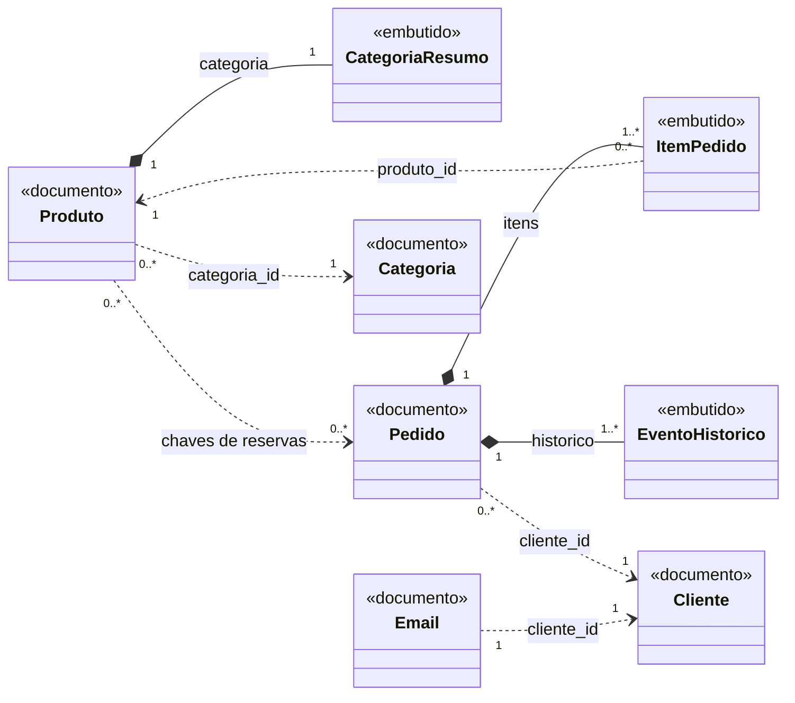

# Modelo documental — Torra & Terra

Substitui o `modelo_er.md` e o `dicionario_dados.md` do projeto relacional (tag `v1-relacional`). A
fonte da verdade é o código: `couchdb/seed.json`, `couchdb/validacao.js` e `app.py`. Consultas e
índices estão em [`consultas_e_indices.md`](consultas_e_indices.md).

## 1. Do relacional ao documental

**Em uma frase:** cinco tabelas viraram cinco tipos de documento num banco só — o que é lido junto
foi embutido, o que tem vida própria virou referência pelo `_id`, e o que guarda o passado virou
snapshot. Não é um para um: `itens_pedido` deixou de ser tabela e `email` apareceu.

| Relacional (`SQL/schema.sql`) | Documental | O que aconteceu |
|---|---|---|
| `categorias` | `categoria` · `categoria:<slug>` | Documento próprio; nome e estado também copiados para cada produto |
| `produtos` | `produto` · `produto:<slug>` | Documento próprio; ganhou `ativo`, a cópia `categoria` e as marcas `reservas` |
| `clientes` | `cliente` · `cliente:<uuid>` | Documento próprio, sem pedidos dentro |
| `UNIQUE (email)` | `email` · `email:<endereço>` | Tipo novo: a unicidade mora no `_id` de um documento-chave |
| `pedidos` | `pedido` · `pedido:<chave>` | Documento próprio, com itens e `historico` embutidos |
| `itens_pedido` | array `itens` dentro do pedido | **Deixou de ser tabela.** `pedido_id`, a FK e o `ON DELETE CASCADE` sumiram. A `moagem` continua no item |
| FKs `cliente_id`, `produto_id`, `categoria_id` | o `_id` do outro documento | Referência; o banco confere o prefixo, não a existência (seção 5) |
| `preco_unitario` congelado | `nome` e `preco_unitario_centavos` no item | Snapshot, agora com o nome |
| `NUMERIC(10,2)` · `SERIAL` · `JOIN` | centavos inteiros · `_id` da aplicação · nada | JSON não tem decimal; não há contador central; o que é lido junto já está junto |

## 2. Os agregados

Losango cheio (`*--`) é **embutido**: vive e é gravado dentro do pai. Seta tracejada (`..>`) é
**referência** pelo `_id` a um documento com vida própria. Os rótulos são os campos.



## 3. Os documentos — dicionário de dados

### 3.1 Campos comuns, chave e partição

| Campo | Tipo JSON | Regra | Por quê |
|---|---|---|---|
| `_id` | string | `<tipo>:<chave>`; nunca muda | Legível no Fauxton e na URL. O prefixo lista uma família pela faixa do índice primário (`_all_docs`), sem índice secundário. Como o `_id` não muda e começa pelo `tipo`, o tipo também não muda |
| `_rev` | string | `<n>-<hash>`, gerado a cada gravação | Controle otimista (slide 15): quem altera devolve o `_rev` que leu; se outro gravou antes, 409 |
| `tipo` | string | `categoria`, `produto`, `cliente`, `email` ou `pedido` | As cinco famílias moram no mesmo banco; é o primeiro campo de todo índice Mango |
| `versao_esquema` | number | `1` em todo documento de dados | Formatos diferentes podem conviver no banco (seção 7) |

**A chave de cada tipo.** `categoria:<slug>` e `produto:<slug>`: catálogo pequeno e curado; o slug
vai na URL (`/produto/chapada-geisha`) e a página do café é um GET pelo `_id` — renomear o café não
muda o slug. `cliente:<uuid4>`: o e-mail pode mudar e o `_id` não, e o `cliente_id` copiado em cada
pedido não carrega o endereço. `email:<endereço>`: o dado único é a chave (3.4). `pedido:<chave>`:
a chave de idempotência nasce na tela de confirmação, e um segundo clique esbarra no mesmo `_id`.

**Partição.** O banco não é particionado (`criar_banco` faz `PUT /torra_terra` sem
`?partitioned=true`); o `:` é só convenção de nome. Particionado por esses prefixos, todos os
pedidos cairiam na partição `pedido` — o hotspot do slide 7 da aula de NoSQL.

### 3.2 `categoria`

```json
{
  "_id": "categoria:chapada-diamantina",
  "tipo": "categoria",
  "nome": "Chapada Diamantina",
  "regiao": "Bahia",
  "descricao": "Altitudes acima de 1.000 m no semiárido baiano. Amplitude térmica alta e maturação lenta. Acidez cítrica marcante e aroma floral.",
  "versao_esquema": 1
}
```

| Campo | Tipo JSON | Regra | Por quê |
|---|---|---|---|
| `nome`, `regiao` | string | obrigatórios, não vazios | Rótulo do filtro do catálogo e estado produtor |
| `descricao` | string | opcional | Texto longo: mora só aqui e é lido por referência na página do café. A categoria não lista seus cafés — essa pergunta vai para `idx_produtos_categoria` |

### 3.3 `produto`

```json
{
  "_id": "produto:chapada-geisha",
  "tipo": "produto",
  "nome": "Chapada Geisha",
  "descricao": "Variedade Geisha adaptada à Bahia. Sete anos de lavoura para chegar a este perfil. O café mais premiado da casa.",
  "preco_centavos": 14800,
  "estoque": 1,
  "torra": "CLARA",
  "nota_sensorial": "Bergamota, jasmim, pêssego branco, chá preto",
  "pontuacao_sca": 91.0,
  "peso_g": 250,
  "ativo": true,
  "categoria_id": "categoria:chapada-diamantina",
  "categoria": { "nome": "Chapada Diamantina", "regiao": "Bahia" },
  "reservas": {},
  "versao_esquema": 1
}
```

| Campo | Tipo JSON | Regra | Por quê |
|---|---|---|---|
| `nome` | string | obrigatório, não vazio | Título do cartão; copiado para o item do pedido |
| `descricao`, `nota_sensorial` | string | opcionais | Textos exibidos inteiros; a descrição fica fora do `fields` do catálogo |
| `preco_centavos` | number, inteiro | `>= 0` | JSON não tem decimal, e o JavaScript da `validate_doc_update` usa ponto flutuante binário, que não representa 0,10. Centavos inteiros são exatos: é o `NUMERIC(10,2)` (decisão N06) |
| `estoque` | number, inteiro | `>= 0` | Última linha de defesa: a baixa que deixaria saldo negativo é recusada pelo banco |
| `torra` | string | `CLARA`, `MEDIA` ou `ESCURA` | Domínio fechado, como o `CHECK` |
| `pontuacao_sca` | number | ausente, `null` ou de 80 a 100 | Café especial pontua 80 ou mais. As duas casas do `NUMERIC(4,2)` não são conferidas |
| `peso_g` | number, inteiro | `> 0` | Peso do pacote |
| `ativo` | boolean | `true` ou `false` | Tira o café de linha sem apagar: some do catálogo, da página e do checkout |
| `categoria_id` | string | começa com `categoria:` | Referência: a região tem vida própria |
| `categoria` | object `{nome, regiao}` | sem regra no banco | Cópia parcial para o cartão (abaixo) |
| `reservas` | object `{pedido_id: quantidade}` | chaves com `pedido:`; valores inteiros `> 0` | Marcas da saga (abaixo) |

**Categoria embutida pela metade.** O cartão do catálogo e o cabeçalho da página do café usam
`categoria.nome` e `categoria.regiao` do próprio produto: o que o `_find` devolve basta. A
`descricao` fica só na `categoria`, lida pelo `_id` na rota `produto`. O custo: se uma região mudar
de nome, todos os produtos dela são regravados, e nada no banco confere que a cópia bate com
`categoria_id`. Hoje isso é editar `seed.json` e rodar `seed-db` — que também recoloca o estoque.

**Reservas.** No checkout, cada café recebe `{pedido_id: quantidade}` no mesmo `_bulk_docs` que
baixa o estoque, como em `{"estoque": 0, "reservas": {"pedido:9b1c4e7a2d8f4a6cb3e05f1d7a9c2e48": 1}}`.
Baixa e marca estão no mesmo documento e entram ou falham juntas. Depois de um timeout, a
compensação devolve estoque só onde há marca, sem devolver em dobro (`checkout_saga.md`).

### 3.4 `email` e `cliente`, na ordem em que o cadastro grava

```json
[
  {
    "_id": "email:ana@exemplo.com",
    "tipo": "email",
    "cliente_id": "cliente:3f6d2a9e-8c41-4b7e-9d25-6a0e1c7b4f83",
    "criado_em": "2026-09-16T17:02:11.482+00:00",
    "versao_esquema": 1
  },
  {
    "_id": "cliente:3f6d2a9e-8c41-4b7e-9d25-6a0e1c7b4f83",
    "tipo": "cliente",
    "nome": "Ana Souza",
    "email": "ana@exemplo.com",
    "senha_hash": "scrypt:32768:8:1$...",
    "criado_em": "2026-09-16T17:02:11.482+00:00",
    "versao_esquema": 1
  }
]
```

| Campo | Tipo JSON | Regra | Por quê |
|---|---|---|---|
| `email.cliente_id` | string | começa com `cliente:` | Aponta o dono do endereço |
| `cliente.nome` | string | obrigatório, não vazio | Vai para a sessão no login: o menu não lê o banco (N11) |
| `cliente.email` | string | com `@` fora da 1ª posição; minúsculas | As rotas normalizam antes de gravar e de buscar |
| `cliente.senha_hash` | string | começa com `scrypt:` ou `pbkdf2:`; o campo `senha` é recusado | A senha em texto puro não entra nem por engano |
| `criado_em` (nos dois) | string, ISO 8601 UTC | sem regra no banco; a aplicação sempre grava | Mesmo fuso e formato ordenam como texto; a reconciliação só libera chave órfã com mais de 10 minutos |

**Por que o documento `email` existe.** O CouchDB não tem `UNIQUE`: só garante a unicidade do
`_id` — dois `PUT` sem `_rev` no mesmo `_id`, e o segundo leva 409. Por isso `cadastrar_cliente`
grava `email:<endereço>` antes do cliente. Índice Mango não impede duplicata, e consultar antes de
gravar abre uma corrida em que dois cadastros não acham nada e os dois gravam; com a chave, quem
decide é o banco (`test_email_unico_mesmo_com_dois_cadastros_ao_mesmo_tempo`). Se o cliente não
chega a ser gravado, a chave é apagada na hora ou pela reconciliação.

### 3.5 `pedido`

```json
{
  "_id": "pedido:9b1c4e7a2d8f4a6cb3e05f1d7a9c2e48",
  "_rev": "2-5e0a...",
  "tipo": "pedido",
  "cliente_id": "cliente:3f6d2a9e-8c41-4b7e-9d25-6a0e1c7b4f83",
  "status": "CRIADO",
  "itens": [
    { "produto_id": "produto:piata-altitude", "nome": "Piatã Altitude", "moagem": "FINA", "quantidade": 2, "preco_unitario_centavos": 8900 },
    { "produto_id": "produto:piata-altitude", "nome": "Piatã Altitude", "moagem": "GRAO", "quantidade": 1, "preco_unitario_centavos": 8900 }
  ],
  "total_centavos": 26700,
  "criado_em": "2026-09-16T17:05:40.118+00:00",
  "historico": [
    { "status": "PENDENTE", "em": "2026-09-16T17:05:40.118+00:00" },
    { "status": "CRIADO", "em": "2026-09-16T17:05:40.391+00:00" }
  ],
  "versao_esquema": 1
}
```

| Campo | Tipo JSON | Regra | Por quê |
|---|---|---|---|
| `cliente_id` | string | começa com `cliente:`; não muda depois de gravado | Referência ao cliente, lido da sessão |
| `status` | string | `PENDENTE`, `CRIADO`, `PAGO`, `ENVIADO` ou `CANCELADO` | `PENDENTE` é novo: é o diário da saga enquanto o estoque é reservado. O `_rev` `2-` mostra as duas gravações |
| `itens` | array de object | ao menos um; gravados, não mudam | Embutidos: lidos e versionados junto com o pedido (slide 14) |
| `itens[].produto_id` | string | começa com `produto:` | Referência: o café tem vida própria |
| `itens[].nome` | string | sem regra no banco | Snapshot: Meus pedidos mostra o nome da época sem ler o produto |
| `itens[].preco_unitario_centavos` | number, inteiro | `>= 0` | Snapshot: o preço congelado do relacional, agora garantido pelo banco |
| `itens[].moagem` | string | `GRAO`, `MEDIA` ou `FINA`; o par com `produto_id` não se repete | Escolhida na compra: o mesmo café em duas moagens são dois itens |
| `itens[].quantidade` | number, inteiro | `> 0` | Moagens diferentes do mesmo café saem do mesmo estoque |
| `total_centavos` | number, inteiro | igual à soma de `quantidade × preco_unitario_centavos` | Mais forte que o `CHECK (total >= 0)`: total que não bate é recusado |
| `criado_em` | string, ISO 8601 UTC | sem regra no banco; a aplicação sempre grava | Último campo de `idx_pedidos_cliente`; relógio da reconciliação |
| `historico` | array de `{status, em, motivo}` | sem regra no banco | Uma entrada por mudança de status; `motivo` só no cancelamento, como "Estoque insuficiente de Chapada Geisha: você pediu 1 e temos 0 em estoque." |

**Por que `historico`, se existe `_rev`.** A compactação descarta o conteúdo das revisões antigas e
guarda só os identificadores: `_rev` é controle de concorrência, não trilha de auditoria.

## 4. Embed x reference x snapshot

| Relação | Decisão | Justificativa |
|---|---|---|
| pedido → itens e historico | Embed | Lidos e versionados junto, nunca sozinhos; itens limitados pelo carrinho, histórico pelas mudanças de status. Um documento só: sem transação |
| produto → reservas | Embed | Baixa e marca precisam entrar juntas, no mesmo documento |
| produto → categoria (`nome`, `regiao`) | Embed parcial — cópia, não snapshot | O cartão se desenha só com o produto. Ao contrário do snapshot, a cópia **deve** acompanhar a origem: mudar a região regrava produtos |
| produto → categoria (`descricao`) | Reference · `categoria_id` | Texto longo, só na página do café; a região tem vida própria |
| item → produto | Reference · `produto_id` + Snapshot · `nome`, `preco_unitario_centavos` | O café muda de nome e de preço; o pedido guarda o que valia na compra e **não deve** acompanhar |
| pedido → cliente, email → cliente | Reference · `cliente_id` | Vida própria; o inverso criaria documento ilimitado (seção 6) |
| cliente → pedidos, categoria → produtos | Nenhuma lista | Respondidas por `idx_pedidos_cliente` e `idx_produtos_categoria` |

## 5. Onde foram parar as constraints

Cada regra do `schema.sql` mora em dois lugares: na `validate_doc_update` (`couchdb/validacao.js`),
que o CouchDB roda a cada gravação — da loja, do Fauxton ou de um `curl` — e recusa com HTTP 403; e
em `app.py`, que confere antes para dar mensagem clara.

| Relacional | `validate_doc_update` | Aplicação |
|---|---|---|
| `id SERIAL PRIMARY KEY` (5 tabelas) | `_id` começa com `<tipo>:`; a unicidade do `_id` é do CouchDB | Escolhe o `_id`: slug na carga, `uuid4` no cadastro, chave no checkout |
| `categorias.nome UNIQUE` | sem equivalente para o texto | A unicidade fica no slug; dois slugs com o mesmo nome passariam |
| `nome NOT NULL` (3 tabelas), `regiao NOT NULL` | texto não vazio | Cadastro exige nome; `validar_produto` na carga |
| `clientes.email NOT NULL UNIQUE` | string, minúsculas | Documento `email:<endereço>`: o 409 barra o repetido |
| `ck_clientes_email_formato` (`@` após a 1ª posição) | `indexOf('@') > 0`, a mesma regra | Rota confere o `@` e baixa para minúsculas |
| `senha_hash NOT NULL` | começa com `scrypt:` ou `pbkdf2:`; recusa `senha` | `generate_password_hash`; senha com 8 ou mais caracteres |
| `preco` e `preco_unitario` `NUMERIC(10,2) NOT NULL CHECK (>= 0)` | centavos inteiros `>= 0`; o do item não muda depois de gravado | `validar_produto`; o do item é copiado do produto em `_montar_pedido` |
| `estoque CHECK (>= 0)` e `peso_g CHECK (> 0)`, com `DEFAULT` | inteiros `>= 0` e `> 0`; `DEFAULT` sem equivalente | `validar_produto`; `_reservar` recusa baixa maior que o saldo |
| `torra` e `moagem` `CHECK IN (...)` | `CLARA`/`MEDIA`/`ESCURA` e `GRAO`/`MEDIA`/`FINA` | `validar_produto`; rota do carrinho e `validar_pedido` |
| `pontuacao_sca CHECK BETWEEN 80 AND 100` | ausente, `null` ou número de 80 a 100 | `validar_produto` |
| `produtos.categoria_id NOT NULL` + FK | começa com `categoria:` | Sem conferência de existência (abaixo) |
| `pedidos.cliente_id NOT NULL` + FK | começa com `cliente:`; não muda | Vem da sessão |
| `status CHECK IN (4 valores)` `DEFAULT 'CRIADO'` | um dos 5 valores, com `PENDENTE` | Nasce `PENDENTE` em `_montar_pedido` |
| `total NUMERIC(10,2) CHECK (>= 0)` | `total_centavos` igual à soma dos itens | `validar_pedido` |
| `criado_em NOT NULL DEFAULT CURRENT_TIMESTAMP` | **sem regra** | Sempre grava `agora_iso()`; índice de pedidos e reconciliação dependem dele |
| `itens_pedido.pedido_id` + FK `ON DELETE CASCADE` | desaparece | O item está dentro do pedido: apagar o pedido leva os itens |
| `itens_pedido.produto_id NOT NULL` + FK | começa com `produto:` | Fase 1 do checkout recusa café inexistente ou inativo |
| `quantidade CHECK (> 0)` | inteiro `> 0` | Rota exige 1 ou mais; `validar_pedido` |
| `UNIQUE (pedido_id, produto_id, moagem)` | o par (`produto_id`, `moagem`) não se repete no array | O carrinho soma na mesma linha; `validar_pedido` |
| `VARCHAR(n)` | sem equivalente | Nenhum limite; o teto é o documento (8 MB no CouchDB 3.5, pelo `max_document_size` padrão; 1 MB no Cloudant) |

**Regras que o relacional não tinha.** Itens de pedido gravado não mudam — a função compara
`produto_id`, `moagem`, `quantidade` e `preco_unitario_centavos`, não o `nome`. O cliente do pedido
não muda e `CANCELADO` não volta a valer, mas as demais transições são livres (`CRIADO` → `PENDENTE`
passa). Também são recusados tipo desconhecido, `_id` sem prefixo, `senha` e reserva malformada.

**O que não tem equivalente: a chave estrangeira.** O CouchDB **não verifica** que `cliente_id`
aponta para um cliente existente — nem `produto_id`, nem `categoria_id`. A `validate_doc_update`
recebe o documento novo, a versão anterior e o contexto de segurança, mas não lê outros documentos:
um pedido de `cliente:nao-existe` passa, e apagar cliente com pedidos também. O que o projeto faz:

1. Confere o formato da referência pelo prefixo.
2. Só cria referência a partir de documento recém-lido ou recém-gravado: o `cliente_id` vem da
   sessão (login ou cadastro); o `produto_id`, da fase 1 do checkout. O checkout não relê o cliente.
3. Não apaga clientes, produtos, categorias nem pedidos; café sai de linha com `ativo: false`.
4. O snapshot deixa o pedido legível sem o produto; a página do café funciona sem a categoria.
5. A reconciliação limpa as órfãs que a loja pode deixar: reserva de pedido inexistente ou
   cancelado, e `email:` sem cliente.

**Um limite do cluster.** Num nó único — como o CouchDB de produção, no Railway —, gravações
concorrentes no mesmo documento se resolvem com 409. Num cluster, como o Cloudant, que guarda três
cópias, duas gravações quase simultâneas poderiam ser aceitas em cópias diferentes — uma recebe 201,
a outra 202 — e o documento ficaria com duas revisões em conflito, só uma vencedora. Isso alcançaria
a chave `email:` e as baixas de estoque; o `banco.py` trata 202 como sucesso, e o projeto não lê
`_conflicts`. O limite não vale para a produção atual e volta numa migração para cluster.

## 6. Documentos limitados

| Estrutura | Teto | Por quê |
|---|---|---|
| `pedido.itens` | um por par (café, moagem): 3 × cafés ativos, 36 hoje | O carrinho soma na linha que já existe |
| `pedido.historico` | um evento por mudança de status: 2 hoje, 4 com `PAGO` e `ENVIADO` | A saga grava `PENDENTE` e depois `CRIADO` ou `CANCELADO` |
| `produto.reservas` | uma marca por checkout em andamento | Sai na fase 5, na compensação ou na reconciliação — que é manual: a marca de uma falha espera alguém rodar o comando |

**O histórico de pedidos não fica dentro do cliente.** Cresceria a cada compra, para sempre, e o
CouchDB recusa documento acima do limite (8 MB por padrão, 1 MB no Cloudant). Cada checkout
regravaria o cliente, que entraria na saga:
duas compras simultâneas do mesmo cliente disputariam o `_rev`. E o login, que lê o cliente
inteiro, carregaria todo o histórico. Em vez disso, o pedido guarda `cliente_id`, e
`idx_pedidos_cliente` responde "pedidos deste cliente", com limite de 50.

## 7. Retenção e versionamento de esquema

**Versionamento.** Todo documento sai com `versao_esquema: 1` (`VERSAO_ESQUEMA` em `app.py` e
`seed.json`). Sem `ALTER TABLE`, formatos diferentes convivem no mesmo banco e o campo diz qual é
qual; hoje nada o lê, e a `validate_doc_update` não o exige. Proposta, **não implementada**: campo
opcional novo mantém a versão; nome ou significado novo muda. O código passaria a ler as duas
versões, gravar só a nova e migrar cada documento na próxima gravação.

**Retenção.** O CouchDB não expira documentos (não há TTL): expirar é tarefa da aplicação — hoje,
só do `flask --app app reconciliar`, rodado à mão. O pedido cancelado não é apagado (N09): é a
trilha de auditoria de uma compra que começou e não fechou. Política proposta:

| Dado | Retenção | Por quê | Hoje |
|---|---|---|---|
| Pedido `CRIADO`, `PAGO`, `ENVIADO` | prazo de guarda fiscal (em regra, 5 anos); depois, arquivar | Registro de venda | não implementado |
| Pedido `CANCELADO` | 12 meses | Auditoria da saga; não houve venda | não implementado |
| Pedido `PENDENTE`, `email:` sem cliente | 10 minutos | Saga ou cadastro interrompidos | a reconciliação cancela o pedido e apaga a chave |
| Marca em `reservas` | minutos | Só existe durante a saga | fase 5, compensação ou reconciliação |
| Cliente e `email:` | enquanto a conta existir | LGPD | não há exclusão de conta |
| Categoria e produto | enquanto estiverem no catálogo | Pedidos antigos têm snapshot | `ativo: false`, sem tela |

**Apagar não é sumir.** Um `DELETE` deixa um túmulo com `_id`, `_rev` e `_deleted`. No CouchDB ele
fica até um `_purge`; no Cloudant, expurgo só por pedido de emergência à IBM, e os túmulos saem
cerca de 90 dias depois. Isso pesa no `email:<endereço>`: o e-mail vai na URL de cada gravação e nos
logs de acesso, sobrevive no túmulo, e a IBM recomenda não usar dado pessoal no `_id`. Correção
proposta, não implementada: chave com HMAC do e-mail e segredo em variável de ambiente. O pedido já
guarda só `cliente_id`. Arquivar custa: cada exclusão é uma escrita — uma ida ao banco no Railway,
e uma das 10 por segundo que o Cloudant Lite aceitaria.
