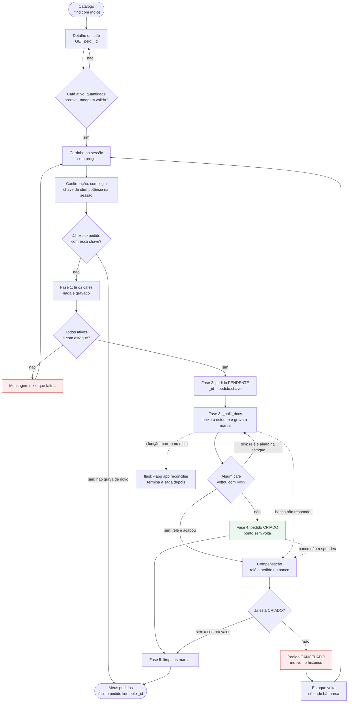

# Requisitos — Torra & Terra (versão NoSQL)

Disciplina: Tratamento e Armazenamento da Informação · FACAMP
Professor: Nivaldo T. Marcusso

Bloco 1 do projeto NoSQL e Entrega 1 do material ("requisitos e consultas").
A versão relacional deste documento está na tag `v1-relacional`; a numeração
dos requisitos foi mantida para a comparação ficar direta.

---

## 1. Problema de negócio

Torrefações de café especial vendem hoje por telefone, WhatsApp e planilha. O
controle de estoque é manual e o pedido é anotado à mão. Isso produz duas dores
recorrentes:

- **Perda de controle do estoque** — o mesmo lote é vendido duas vezes porque duas vendas aconteceram em paralelo e ninguém baixou o saldo a tempo.
- **Pedido inconsistente** — a venda fica registrada pela metade: o pedido existe, mas o estoque não baixou, ou o total não bate com os itens.

O material NoSQL acrescenta uma terceira: o catálogo muda de forma. Café
especial ganha informação com o tempo — lote e data de torra já estavam no
backlog do relacional —, e o cadastro precisa acompanhar sem migração.

**Pergunta central:** como organizar a loja em documentos — catálogo, clientes
e pedidos — mantendo desempenho, rastreabilidade e **consistência suficiente**
para o fluxo de compra, num banco que não tem transação entre documentos?

O tema café especial continua de propósito: a **moagem** é escolhida na compra
e existe só no item, nunca no café — o par café + moagem é a identidade do item.

---

## 2. Por que NoSQL aqui

A escolha se justifica pelo **padrão de acesso** da loja (slide 9, dica 1):

| Padrão de acesso | Como o modelo de documentos atende | Por quê |
|---|---|---|
| **Dados lidos juntos.** O pedido é sempre lido com os seus itens, nunca um item sozinho | Itens **embutidos** no documento `pedido`, com nome e preço copiados como *snapshot* | Uma leitura monta a tela inteira. O pedido é gravado de uma vez e, depois, só o status evolui |
| **Catálogo que evolui.** Cafés ganham atributos com o tempo | Documento JSON sem esquema fixo, com `versao_esquema` em todo documento | Campo novo não pede `ALTER TABLE`, e a versão permite distinguir o formato antigo do novo sem migrar tudo de uma vez |
| **Leitura domina.** Cada compra é precedida de muitas visitas ao catálogo e ao detalhe | O cartão sai de uma consulta indexada que traz só os seus campos, com a região embutida; o detalhe é um GET pelo `_id` legível (`produto:chapada-geisha`) | A vitrine se monta sem junção, e o slug da URL já é a chave do documento |

### O que se perde, e como compensamos

A unidade de consistência do CouchDB é **um documento**. O que o PostgreSQL
garantia entre tabelas passa a ser da aplicação:

| O PostgreSQL garantia | No CouchDB | O que o projeto faz |
|---|---|---|
| Transação entre tabelas (`COMMIT`/`ROLLBACK`) | Não existe. `_bulk_docs` grava vários documentos, mas não é transação (slide 26) | Checkout como **saga**: reserva, confirmação e compensação (RF05) |
| `SELECT ... FOR UPDATE` | Não há trava. Gravar com `_rev` velho dá HTTP 409 | Relê o documento e decide de novo, com o saldo atual |
| `CHECK` e `NOT NULL` | Não há constraint declarativa | `validate_doc_update` em `couchdb/validacao.js`, espelhada em `validar_produto` e `validar_pedido` |
| `UNIQUE (email)` | Só o `_id` é único | Documento-chave `email:<endereço>` |
| `FOREIGN KEY` e `JOIN` | Sem junção e sem integridade referencial | Embute o que é lido junto; referencia pelo `_id` o que tem vida própria |
| `NUMERIC(10,2)` | JSON não tem tipo decimal | Dinheiro em centavos inteiros |

A troca compensa porque a loja lê agregados inteiros muito mais do que grava, e
o custo fica num lugar só: o checkout. Modelo em
[`modelo_documental.md`](modelo_documental.md); decisões em
[`decisoes.md`](decisoes.md).

---

## 3. Consultas antes do modelo

Lista feita **antes** de desenhar os documentos (slide 9, dicas 2 e 3; slide 16):
primeiro o que a loja precisa perguntar; depois o formato do `_id`, o que embutir
e qual índice criar. Cada decisão da última coluna nasceu de uma linha da tabela.

| # | Consulta | Quem usa | Frequência | Acesso | Decisão que gerou |
|---|---|---|---|---|---|
| C1 | Cafés ativos em ordem alfabética | Cliente · catálogo (RF01) | Toda visita à página inicial — a mais frequente | `_find` com `idx_produtos_catalogo [tipo, ativo, nome]` e `fields` só do cartão | Região embutida no café (`categoria: {nome, regiao}`): o cartão não pede segunda leitura |
| C2 | Cafés ativos de uma região | Cliente · filtro do catálogo (RF01) | Frequente | `_find` com `idx_produtos_categoria [tipo, categoria_id, nome]`; `ativo` conferido sobre os três cafés da região | `categoria_id` como referência |
| C3 | Regiões para o filtro | Cliente · catálogo (RF01) | Toda visita à página inicial | Índice primário: `_all_docs` na faixa de `_id` `categoria:` | O `_id` começa pelo tipo: listar uma família não pede índice secundário |
| C4 | Um café e a descrição da sua região | Cliente · detalhe (RF02) | Frequente | GET `produto:<slug>` e GET `categoria:<slug>` | `_id` legível, igual ao slug da URL; descrição longa só na categoria, por referência |
| C5 | Preço e estoque atuais das linhas do carrinho | Cliente · carrinho e checkout (RF03) | Cada exibição do carrinho | `_all_docs` com `keys`: uma ida para todas as linhas | Carrinho na sessão sem preço; o preço sempre vem do banco |
| C6 | Cliente pelo e-mail | Cliente · login (RF04) | Cada login | `_find` com `idx_clientes_email [tipo, email]` | E-mail normalizado em minúsculas |
| C7 | O e-mail já tem dono? | Cliente · cadastro (RF04) | Cada cadastro | PUT de `email:<endereço>` sem `_rev`: se já existe, 409 | Documento-chave `email`: a unicidade vem do `_id`, não de consulta |
| C8 | Ler e reservar os cafés da compra | Cliente · checkout (RF05) | Cada compra | `_all_docs` com `keys`, depois `_bulk_docs` | Marca `reservas: {pedido_id: quantidade}` no café; `_id` do pedido = chave de idempotência |
| C9 | Pedidos do cliente, do mais novo ao mais antigo | Cliente · Meus pedidos (RF06) | Cada visita à tela | `_find` com `idx_pedidos_cliente [tipo, cliente_id, criado_em]`, até 50; o último pedido também por GET | Itens embutidos; `criado_em` em ISO 8601 UTC, que ordena como texto |
| C10 | Pedidos `PENDENTE` antigos | Operação · `flask reconciliar` | Rara, manual | `_find` **sem índice**, de propósito | Um índice custaria escrita em todo pedido para servir uma consulta rara |
| C11 | Marcas de reserva e e-mails órfãos | Operação · `flask reconciliar` | Rara, manual | `_all_docs` nas faixas `produto:` e `email:` | Prefixo do tipo no `_id` |

Resultado: **quatro índices secundários**, um por consulta frequente que filtra
ou ordena (C1, C2, C6, C9), cada um justificado em
[`couchdb/indices.json`](../couchdb/indices.json) e conferido pelo `_explain` em
`test_indices_atendem_as_consultas`. Em produção, no CouchDB do Railway, não
há cota por requisição, mas cada ida ao banco é espera (20 ms de mediana, medidos
em `/saude`): uma visita ao catálogo faz duas, C1 ou C2 mais C3. Numa migração
para o Cloudant Lite, a conta mudaria de natureza: segundo a IBM, GET pelo `_id`
conta como leitura (20/s), mas `_find` **e** `_all_docs` contam como consulta
global (5/s).

---

## 4. Atores

| Ator | Objetivo | No MVP? |
|---|---|---|
| **Cliente** | Encontrar cafés, saber preço, escolher moagem e concluir a compra | **Sim** |
| **Operação** | Controlar estoque, pedidos e clientes sem retrabalho | Parcial — o estoque baixa sozinho no checkout e `flask --app app reconciliar` termina compras interrompidas, mas não há tela de operação |
| **Gestão** | Relatórios de vendas, volume e produtos mais vendidos | **Não** — fora do MVP |
| **TI/Desenvolvimento** | Escopo claro para modelar, programar, testar e operar | **Sim** — este documento, o [roteiro do Fauxton](../FAUXTON_ROTEIRO.md), os testes e o `/saude` |

---

## 5. Requisitos funcionais

| ID | Requisito | Documentos | No material (slide 6) | Prioridade |
|---|---|---|---|---|
| **RF01** | Catálogo: listar os cafés ativos lendo do banco, com filtro por região | `produto`, `categoria` | RF01 Listar produtos | Alta |
| **RF02** | Detalhe do café: nota sensorial, torra, pontuação SCA, peso e descrição da região | `produto`, `categoria` | Sem número; passo "cliente consulta" do slide 5 | Alta |
| **RF03** | Carrinho: adicionar item escolhendo quantidade **e moagem**, guardado na sessão | sessão; lê `produto` | Sem número; passo "adiciona item" do slide 5 | Alta |
| **RF04** | Cadastro e login, com e-mail único e senha guardada só como hash | `cliente`, `email` | RF02 Cadastrar cliente e RF03 Autenticar | Alta |
| **RF05** | Checkout: transformar o carrinho em pedido e baixar o estoque sem deixar compra pela metade valendo | `pedido`, `produto` | RF04 Finalizar pedido | **Crítica** |
| **RF06** | Meus pedidos: histórico do cliente logado, com os itens de cada pedido | `pedido` | RF05 Consultar histórico | Média |

### Critérios de aceite

**RF01 — Catálogo**
- A listagem vem do banco, por consulta Mango com índice, e só traz cafés com `ativo: true`: desativar um café tira ele do catálogo
- Cada cartão mostra região, torra, pontuação SCA, nota sensorial e preço em `R$ 0,00`, convertido de centavos só na tela
- As regiões do filtro vêm do banco; sem filtro, todos os cafés ativos aparecem em ordem alfabética

**RF02 — Detalhe do café**
- Café inexistente ou desativado retorna 404, não erro 500
- A descrição longa da região vem do documento `categoria`, lido por referência
- Dali se adiciona ao carrinho escolhendo moagem e quantidade; café esgotado não mostra o formulário

**RF03 — Carrinho**
- O café precisa existir e estar ativo; a quantidade, ser pelo menos 1; a moagem, `GRAO`, `MEDIA` ou `FINA`
- O mesmo café em duas moagens ocupa **duas linhas**; a mesma moagem soma na linha que já existe
- A sessão guarda só café, quantidade e moagem — **nunca o preço**, relido do banco a cada exibição com o total recalculado

**RF04 — Cadastro e login**
- E-mail normalizado (minúsculas, sem espaços nas pontas) e único, até com dois cadastros simultâneos — decide o 409 no `_id` `email:<endereço>`, não uma consulta prévia; repetido dá mensagem clara, não erro 500
- Senha com pelo menos 8 caracteres, gravada só como hash; o banco recusa documento de cliente com o campo `senha`
- Login errado não revela se o erro foi no e-mail ou na senha; rota protegida manda para o login e depois devolve o cliente aonde estava, só para destino interno
- Se o cadastro cair entre gravar o e-mail e gravar o cliente, o e-mail volta a ficar livre, na hora ou pela reconciliação

**RF05 — Checkout** *(o requisito mais importante)*

No relacional, o critério era "ou grava tudo, ou não grava nada", garantido pelo
banco. Sem transação entre documentos, passa a ser **"ou a compra vale inteira,
ou nada dela fica valendo"**, garantido pela aplicação numa saga de cinco fases:

| Fase | O que grava | Se falhar |
|---|---|---|
| 1. Ler e validar | Nada | Mensagem para o cliente; não há o que desfazer |
| 2. Registrar a intenção | Pedido `PENDENTE`, com `_id` = chave de idempotência | 409: a mesma compra já foi registrada. Sem resposta do banco: o pedido é cancelado, se chegou a entrar |
| 3. Reservar | Um `_bulk_docs`: cada café baixa o estoque e ganha a marca `reservas: {pedido_id: quantidade}` | 409 num café: relê e tenta de novo. Estoque acabou ou banco falhou: compensação |
| 4. Confirmar | Pedido `CRIADO` — o ponto sem volta | Compensação, que relê o pedido antes de desfazer qualquer coisa |
| 5. Limpar as marcas | Tira a marca dos cafés | Nada a desfazer: a marca não muda saldo, e a reconciliação limpa |

- Estoque insuficiente na fase 1: **nenhum documento é gravado**, a mensagem diz **qual** café faltou, quanto foi pedido e quanto havia, e o carrinho fica intacto. Moagens do mesmo café somam no mesmo estoque (2 em grão e 1 fina pedem 3). Café inexistente ou desativado: nada é gravado e o pedido não é finalizado
- Falha nas fases 3 ou 4 dispara a **compensação**: primeiro o pedido vira `CANCELADO`, com o motivo no `historico`; só depois o estoque volta, e **só onde há marca** — por isso ela pode rodar de novo sem devolver em dobro. Se, ao reler, o pedido já está `CRIADO` (a resposta se perdeu), nada é desfeito
- Nome e preço são copiados para o item na compra; reajuste posterior não altera o pedido, e o banco recusa mudança nos itens de um pedido gravado
- Duas compras simultâneas não vendem o mesmo lote: a reserva grava sobre o `_rev` lido; se a outra gravou antes, vem 409 e a saga decide de novo com o saldo novo
- A chave de idempotência nasce quando o cliente abre a tela de confirmação e vira o `_id` do pedido: clique duplo ou reenvio não cria segundo pedido nem baixa estoque em dobro
- Saga interrompida (a função serverless morreu no meio): `flask --app app reconciliar` cancela o `PENDENTE` com mais de 10 minutos e devolve o estoque reservado; rodar de novo não muda nada

**"Nada fica valendo" não é "nada é gravado".** O `ROLLBACK` não deixava rastro.
Aqui, a partir da fase 2 o pedido já existe, e a compensação não o apaga:
cancela. Ele fica como trilha de auditoria — quando a compra começou e por que
não fechou — e aparece em Meus pedidos com o motivo. O que importa para o
negócio, o estoque, volta exatamente ao que era, e o banco não deixa um
cancelado voltar a valer. Testes em `tests/test_checkout.py`, `test_rotas.py` e
`test_validacao.py`; matriz de falhas em [`checkout_saga.md`](checkout_saga.md).

**RF06 — Meus pedidos**
- Só mostra os pedidos do cliente logado: o filtro por `cliente_id` faz parte da própria consulta
- Do mais novo para o mais antigo, até 50, cada um com itens, moagem, preço congelado, status e data no horário de Brasília; o cancelado mostra o motivo registrado no histórico
- O pedido recém-feito aparece mesmo que o índice ainda não o tenha alcançado (seção 6)

---

## 6. Requisitos não funcionais

| ID | Categoria | Requisito | Como é verificado |
|---|---|---|---|
| **RNF01** | Integridade | As regras valem **no banco**: a `validate_doc_update` recusa com HTTP 403 o documento inválido, venha da loja, do Fauxton, de um `curl` ou de uma replicação. A aplicação confere as mesmas regras antes, só para dar mensagem clara | `couchdb/validacao.js`; `tests/test_validacao.py` — camada da aplicação sempre, camada do banco (`couchdb_real`) no GitHub Actions; [roteiro do Fauxton](../FAUXTON_ROTEIRO.md), passo 7 |
| **RNF02** | Integridade | Nenhuma compra fica pela metade valendo: saga com compensação idempotente e reconciliação | `tests/test_checkout.py`; roteiro do Fauxton, passos 9 e 10 |
| **RNF03** | Concorrência | Duas gravações no mesmo documento nunca se sobrescrevem às cegas: `_rev`, 409 e releitura | `test_gravar_com_rev_velho_da_409`, `test_conflito_409_e_resolvido_relendo_o_documento`; roteiro do Fauxton, passo 8 |
| **RNF04** | Consistência | A consistência esperada de cada operação está registrada (tabela abaixo), e a tela afetada pela consistência eventual a contorna | Rota `meus_pedidos` em `app.py`. Sem teste do atraso do índice: o dublê, o CouchDB local e o de produção, todos de nó único, respondem já atualizados |
| **RNF05** | Segurança | Senha só como hash scrypt, e o banco recusa `senha` em texto puro. Credenciais e `SECRET_KEY` só em variável de ambiente; em produção, sem elas, a loja responde 503 dizendo o nome do que falta, nunca o valor; usuário e senha saem da URL antes de qualquer log. A loja entra no banco com o usuário restrito `torra_app`, que não grava design documents nem apaga o banco | `test_senha_nunca_e_gravada_em_texto_puro`, `test_banco_recusa_senha_em_texto_puro`, `test_erro_de_conexao_nao_vaza_a_senha`, `test_producao_sem_segredos_responde_503_dizendo_o_que_falta`; `.env` no `.gitignore`; permissões conferidas contra o Railway ([`deploy_vercel.md`](deploy_vercel.md), passo 2.3) |
| **RNF06** | Segurança | Proteções web do relacional mantidas: token CSRF, CSP com `script-src 'none'`, `X-Frame-Options`, HSTS atrás do proxy, cookie `HttpOnly` e `SameSite=Lax`, página logada fora do cache, sem *open redirect* | `tests/test_seguranca.py` |
| **RNF07** | Desempenho | Cada consulta frequente tem índice próprio, confirmado pelo CouchDB; o que dá para ler pelo `_id` não usa `_find`; o catálogo traz só os campos do cartão | `couchdb/indices.json`; `test_indices_atendem_as_consultas`, `test_consulta_do_catalogo_traz_so_os_campos_do_cartao`; roteiro do Fauxton, passos 4 e 5 |
| **RNF08** | Disponibilidade | Banco fora do ar vira página 503, não erro 500. Leitura é repetida em falha de rede ou 5xx; o 429 de limite de vazão, como o do Cloudant, é repetido com espera, até em escrita; timeout de 3 s para conectar e 10 s para ler | `test_banco_fora_do_ar_mostra_pagina_503`, `test_limite_de_vazao_429_e_repetido` |
| **RNF09** | Observabilidade | `/saude` devolve JSON com o estado do banco e a latência (200 ou 503). O log registra banco indisponível, compensação que não concluiu, marca deixada para a reconciliação e consulta que rodou sem índice | `test_saude_informa_o_estado_do_banco`; logs do Vercel; `railway logs` e `railway metrics` do banco ([`deploy_vercel.md`](deploy_vercel.md)) |
| **RNF10** | Portabilidade | O mesmo código fala com o CouchDB 3.5 local (`docker-compose.yml`) e com o CouchDB do Railway; só muda o `COUCHDB_URL`. Trocar o banco de produção do Cloudant, que era o plano, pelo Railway não mudou nenhuma linha. O suporte ao Cloudant (token IAM, 429) está no código, mas não foi testado contra uma instância real. A suíte roda sem Docker (dublê em memória) e contra CouchDB de verdade | `.github/workflows/testes.yml`: um job contra o CouchDB 3.5, outro com o dublê; decisão N02 |
| **RNF11** | Recuperação | Backup por replicação do CouchDB do Railway para um CouchDB local; restauração por replicação para um banco novo, conferindo as contagens. Compra interrompida é terminada pela reconciliação | Roteiro do Fauxton, passo 11; `deploy_vercel.md`, seção Operação; testes `test_reconciliacao_*` |
| **RNF12** | Usabilidade | Interface mobile-first, contraste mínimo AA, `<label>` em todo campo | Abrir no celular |

### Consistência esperada por operação (slide 9, dica 5)

| Operação | Consistência esperada | Onde isso importa |
|---|---|---|
| Ler um documento pelo `_id` (GET) | Forte: devolve a última versão confirmada (num cluster, como o Cloudant, lida por quórum) | Detalhe do café, releitura do pedido na compensação, último pedido em Meus pedidos |
| Gravar um documento | Forte **por documento**: grava sobre o `_rev` lido ou recebe 409, nunca sobrescreve às cegas | Reserva, cadastro, confirmação: mesmo que a leitura anterior esteja velha, a gravação não passa |
| Gravar um lote (`_bulk_docs`) | Por documento: cada um entra ou volta com erro, independente dos outros | É por isso que a saga confere o resultado de cada café |
| A compra inteira | Da saga, não do banco: por um instante há pedido `PENDENTE` com estoque reservado; ao fim, ou `CRIADO` com toda a baixa, ou `CANCELADO` sem nenhuma | RF05 |
| Consulta Mango (`_find`) | Num nó único — o CouchDB local e o de produção, no Railway — o índice é atualizado antes de responder. Num cluster, como o Cloudant, seria **eventual**: a consulta poderia ser respondida por uma cópia que ainda não recebeu a gravação | Meus pedidos lê o último pedido também pelo `_id`, proteção que só faz diferença num cluster; o cadastro já deixa o cliente logado, sem depender do índice do login |
| Estoque mostrado no catálogo e no carrinho | Informativa: pode estar defasada no instante da compra | Quem decide é a reserva, gravada sobre o `_rev` |

---

## 7. Backlog

**MVP — entregue:** RF01 a RF06, com o **checkout como saga**; `init-db` e
`seed-db`; testes com dublê e com CouchDB de verdade; roteiro do Fauxton; deploy
no Vercel, com o CouchDB no Railway.

**Extensão — os desafios do slide 51:**

| Nível | Desafio | Conceito | Situação |
|---|---|---|---|
| 1 | Persistir carrinho | estado/documentos | Não feito — no MVP o carrinho é processo, não entidade (seção 9) |
| 2 | Avaliações | embed x reference | Não feito. Se entrar, cada avaliação vira documento próprio que referencia o café: embutida, faria o produto crescer sem limite (slide 17, dica 5) |
| 3 | Índice categoria/preço | query-driven design | **Feito em parte** — `idx_produtos_categoria` atende o filtro por região; não há filtro nem ordenação por preço |
| 4 | Conflito no estoque | MVCC | **Feito** — reserva sobre o `_rev` lido, 409 e releitura, com teste |
| 5 | Compensação no checkout | consistência | **Feito** — saga com marcas de reserva e um teste para cada jeito de falhar |
| 6 | Replicação contínua | distribuição | Não feito — só replicação única, manual, para backup. Com gravação dos dois lados, os conflitos (`_conflicts`) precisariam de resolução, que a loja não tem |

**Evolução fora do material:** pagamento real e frete; **controle de lote e data
de torra**, a evolução mais natural do domínio, que o `versao_esquema` permite
introduzir sem migrar os cafés antigos de uma vez; área administrativa e
relatórios; reconciliação agendada; paginação de Meus pedidos.

---

## 8. Fluxo do processo

Os losangos são os pontos de decisão. `V1` valida no formulário; `V2` valida
lendo, sem gravar nada; `V3` é o controle otimista em ação — o 409 manda reler,
nunca sobrescrever; `V4` torna a compensação segura, porque ela decide pelo que
está gravado no banco, não pelo que a função supõe.

---

## 9. Limitações conhecidas

- **Sem pagamento real nem frete.** O pedido confirmado fica `CRIADO`; `PAGO` e `ENVIADO` existem no domínio, mas nada na loja chega a eles. O total é a soma dos itens.
- **Sem área administrativa nem relatórios.** Cafés e estoque vêm do `seed-db`; mudar exige o Fauxton ou a API, e aí vale a `validate_doc_update`.
- **Carrinho na sessão.** O carrinho é processo, não entidade: some ao trocar de dispositivo. O cookie é assinado, não cifrado — o cliente lê, mas não altera, o conteúdo; por isso o preço não vai nele.
- **Reconciliação manual.** `flask --app app reconciliar` não roda sozinha: uma compra interrompida fica `PENDENTE`, com o estoque reservado, até alguém rodar o comando.
- **Banco em nó único.** O CouchDB de produção é um container só, no Railway, sem réplica: se ele cair, a loja mostra a página de indisponível até ele voltar, e o backup é uma replicação feita à mão. Numa migração para o Cloudant Lite entrariam os limites de vazão — 20 leituras, 10 escritas e 5 consultas globais por segundo. Uma compra, contando a volta para Meus pedidos, faz quatro consultas globais e 2k + 2 gravações, sendo k o número de cafés diferentes no carrinho; acima do limite vem 429, que o `banco.py` espera e repete.
- **Meus pedidos mostra os 50 mais recentes**, sem paginação.
- **O banco confere o formato da referência, não a existência.** A `validate_doc_update` exige que `categoria_id` comece com `categoria:`, mas não sabe se a categoria existe. Quem garante é a aplicação — o checkout lê cada café antes de reservar.
- **O histórico do pedido não é imutável no banco.** A `validate_doc_update` protege itens, cliente e cancelamento; as demais mudanças de status e o `historico` dependem da aplicação.
- **Um usuário da loja para todos os documentos.** Em produção, a loja entra com `torra_app`, que não grava design documents nem apaga o banco — o `admin` fica só na máquina de quem roda `init-db`. Mas o `torra_app` lê e grava qualquer documento do `torra_terra`: o CouchDB não dá permissão por tipo de documento. O que ele grava passa pela `validate_doc_update`, como tudo. Localmente, com o docker-compose, a loja usa o `admin`.
